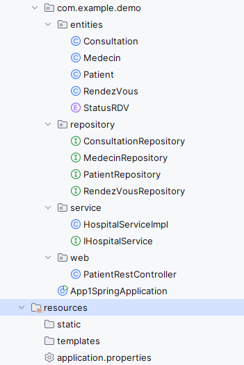
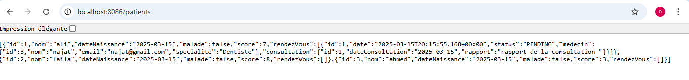

# tp2_ORM_JPA_Hib_Sp_Dt
tp2:ORM JPA Hibernate Spring Data
## part1 - Hospital Management System

This project is a **Spring Boot** application that manages  patients, consultations, medical appointments, and doctors. using **Spring Data JPA**, **H2 Database (later migrated to MySQL)**, **Spring Web**, and **Lombok**.

##  Technologies Used
- Java 23
- Spring Boot
- Spring Data JPA
- H2 Database (migrated to MySQL)
- Lombok

##  Project Structure
 

##  Project Configuration
- Use **Spring Initializr** to generate a Spring Boot project with the following dependencies:
  - **Spring Web**
  - **Spring Data JPA**
  - **H2 Database**
  - **Lombok**

###  `application.properties` (H2 Database)
```properties
spring.application.name=app1Spring
server.port=8086
spring.datasource.url=jdbc:h2:mem:hospital
spring.h2.console.enabled=true
```
##  Entities 
### `Patient`
```java
package com.example.demo.entities;

import jakarta.persistence.*;
import lombok.*;

import java.util.Collection;
import java.util.Date;
@Entity
@NoArgsConstructor
@AllArgsConstructor
@Getter
@Setter @ToString
public class Patient {
    @Id
    @GeneratedValue(strategy = GenerationType.IDENTITY)
    private Long id;
    private String nom;
    @Temporal(TemporalType.DATE)
    private Date dateNaissance;
    private boolean malade;
    private int score;
    @OneToMany(mappedBy = "patient",fetch = FetchType.LAZY)
    private Collection<RendezVous> rendezVous;

}
```
### `Medecin` 
```java
@Entity
@NoArgsConstructor @AllArgsConstructor @Data
public class Medecin {
    @Id @GeneratedValue(strategy = GenerationType.IDENTITY)
    private Long id;
    private String nom;
    private String email;
    private String specialite;
    @OneToMany(mappedBy = "medecin",fetch = FetchType.LAZY)
    @JsonProperty(access = JsonProperty.Access.WRITE_ONLY)
private Collection<RendezVous> rendezVous;
}
```
### `RendezVous` 
```java
@Entity
@Data
@NoArgsConstructor @AllArgsConstructor
public class RendezVous {
    @Id
    @GeneratedValue(strategy = GenerationType.IDENTITY)
    private Long id;
    private Date date;
    @Enumerated(EnumType.STRING)
    private StatusRDV status;
    @ManyToOne
    @JsonProperty(access = JsonProperty.Access.WRITE_ONLY)
    private  Patient patient;
    @ManyToOne
    private Medecin medecin;
    @OneToOne(mappedBy = "rendezVous")
    private Consultation consultation;
}
```
### `Consultation` 
```java
@Entity
@NoArgsConstructor @AllArgsConstructor @Data
public class Consultation {
    @Id @GeneratedValue(strategy = GenerationType.IDENTITY)
    private Long id;
    @Temporal(TemporalType.DATE)
    private Date dateConsultation;
    private String rapport;
    @OneToOne
    @JsonProperty(access = JsonProperty.Access.WRITE_ONLY)
    private RendezVous rendezVous;
}
```
## Repositories (Interfaces)
**`PatientRepository`**
```java
package com.example.demo.repository;
import com.example.demo.entities.Patient;
import org.springframework.data.jpa.repository.JpaRepository;
import java.util.List;
public interface PatientRepository extends JpaRepository<Patient,Long> {
public List<Patient> findByNomContainsIgnoreCase(String nom);
public Patient findByNom(String nom);
}
```
 - Extends `JpaRepository` to provide CRUD operations for the `Patient` entity.
- Methods:
     - `findByNom(String nom)`: Find a patient by their name.
### Remark:
The structure of `PatientRepository` is the same for the other repositories in the application. Specifically:
- **`MedecinRepository`**: Manages the `Medecin` (Doctor) entity.
- **`RendezVousRepository`**: Manages the `RendezVous` (Appointment) entity.
- **`ConsultationRepository`**: Manages the `Consultation` entity.
All of these repositories extend `JpaRepository` and provide the same basic CRUD operations, along with any custom queries specific to each entity.
## Services
**`HospitalServiceImpl`**
```java
@Service
@Transactional
public class HospitalServiceImpl implements IHospitalService{
    private PatientRepository patientRepository;
    private MedecinRepository medecinRepository;
    private RendezVousRepository rendezVousRepository;
    private ConsultationRepository consultationRepository;
    public HospitalServiceImpl(PatientRepository patientRepository, MedecinRepository medecinRepository, RendezVousRepository rendezVousRepository, ConsultationRepository consultationRepository) {
        this.patientRepository = patientRepository;
        this.medecinRepository = medecinRepository;
        this.rendezVousRepository = rendezVousRepository;
        this.consultationRepository = consultationRepository;
    }
    @Override
    public Patient savePatient(Patient patient) {
        return patientRepository.save(patient);
    }
    @Override
    public Medecin saveMedecin(Medecin medecin) {
        return medecinRepository.save(medecin);
    }
    @Override
    public RendezVous saveRDV(RendezVous rendezVous) {
        //rendezVous.setId(UUID.randomUUID().toString());
        return rendezVousRepository.save(rendezVous);
    }
    @Override
    public Consultation saveConsultation(Consultation consultation) {
        return consultationRepository.save(consultation);
    }
    @Override
    public Patient findPtientById(Long id) {
        return patientRepository.findById(id).get();
    }
    @Override
    public Patient findPtientByName(String nom) {
        return patientRepository.findByNom(nom);
    }
    @Override
    public Medecin findMedByName(String nom) {
        return medecinRepository.findByNom(nom);
    }
    @Override
    public RendezVous findRDVById(Long id) {
        return rendezVousRepository.findById(id).get();
    }}
```
   - Implements `IHospitalService` and handles business logic for managing patients, doctors, appointments, and consultations.
   - Methods:
     - `savePatient(Patient patient)`: Saves a new patient.
     - `saveMedecin(Medecin medecin)`: Saves a new doctor.
     - `saveRDV(RendezVous rendezVous)`: Schedules a new appointment.
     - `saveConsultation(Consultation consultation)`: Saves consultation details.
     - `findPtientById(Long id)`: Finds a patient by their ID.
     - `findPtientByName(String nom)`: Finds a patient by their name.
     - `findMedByName(String nom)`: Finds a doctor by their name.
     - `findRDVById(Long id)`: Finds an appointment by its ID.    
   ## PatientRestController
```java
@RestController
public class PatientRestController {
    @Autowired
    private PatientRepository patientRepository;
    @GetMapping("/patients")
    public List<Patient> patientList(){
        return patientRepository.findAll();
    }
}
```
- A REST controller that handles HTTP requests for managing patient records.   
**exemple**  
   
